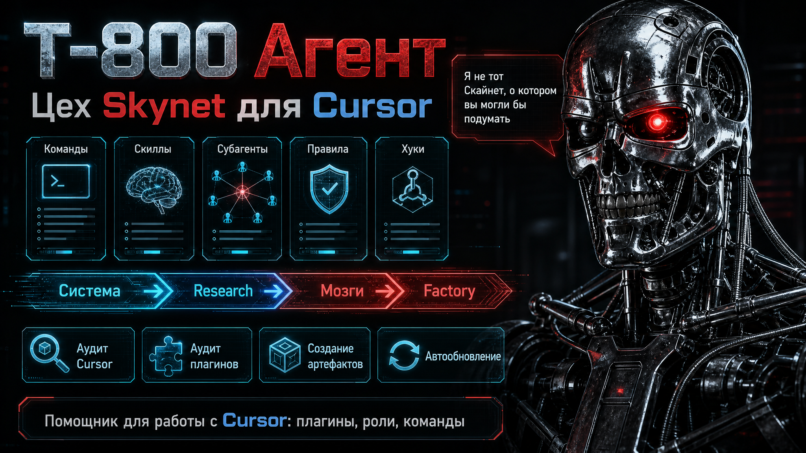

# T-800 Agent

<p align="center">
  
</p>

<p align="center">
  <strong>Цех Skynet для Cursor</strong><br/>
  Плагин для создания, аудита и правки субагентов, skills, команд, rules и hooks.<br/>
  <em>«Я не тот Скайнет, о котором вы могли бы подумать.»</em>
</p>

<p align="center">
  <a href="https://github.com/Khar-AG/t-800-agent/releases"></a>
  <a href="https://github.com/Khar-AG/t-800-agent"></a>
  
  
</p>

---

## Содержание

1. [Зачем нужен T-800](#зачем-нужен-t-800)
2. [Что умеет](#что-умеет)
3. [Установка (один раз)](#установка-один-раз)
4. [Как начать работу](#как-начать-работу)
5. [Обновление](#обновление)
6. [Все команды](#все-команды)
7. [Примеры промптов](#примеры-промптов)
8. [Как устроен конвейер](#как-устроен-конвейер)
9. [Частые вопросы](#частые-вопросы)

---

## Зачем нужен T-800

В Cursor быстро копится хаос: десятки `alwaysApply` rules, чужие skills, дубли команд, «мёртвые» субагенты.  
**T-800 Agent** — отдел, который помогает **правильно** собирать и чистить эту систему, а не править файлы «на глаз» в чате.

Он закрывает технический контур вокруг Cursor:

| Задача | Команда |
|--------|---------|
| Создать skill / агента / команду / rule / hook | `/t800-start` |
| Точечно поправить по списку файлов | `/t800-fix` |
| Проверить свой Cursor на лишнее | `/t800-audit` |
| Разобрать один плагин (карта + orphans) | `/t800-plugin-audit` |
| Быстрая диагностика установки | `/t800-doctor` |
| Первый запуск / обзор | `/t800-bootstrap` · `/t800-onboard` |

```text
Система → Research → Мозги → Factory
```

Директор зовёт **лидов отделов**; специалисты внутри отдела запускаются сами.

---

## Что умеет

### Создание артефактов Cursor
- субагенты (`agents/*.md`);
- skills (`.cursor/skills/`);
- slash-команды (`commands/`);
- rules (`.mdc`);
- hooks (`hooks.json` + shell);
- install / validate / gate scripts.

Перед сборкой — разведка актуальных практик (GitHub, docs, cookbooks), сверка с документацией Cursor, machine gate на выходе.

### Аудит Cursor
Карта global vs local: rules, skills, commands, agents, plugins.  
Оценка «жира» (`alwaysApply` + размер). Диалог: оставить / сузить / удалить.  
Без автоудаления — решения за вами.

### Аудит плагина
Инвентарь одного `--plugin-root`: граф команда↔агент, orphans, scorecard alwaysApply.  
Отчёт → память **целевого** проекта (`plugin-memory/audits/` и т.п.), не в KB T-800.

### Здоровье
`/t800-doctor` — scripts-only: версия, memory, STATE, counts.  
Автопроверка версии при **новом чате** (см. [Обновление](#обновление)).

---

## Установка (один раз)

Нужны: Cursor, режим чата **Agent**, доступ в интернет (для clone / автообновлений).

### Вариант A — с GitHub (рекомендуется)

```bash
git clone https://github.com/Khar-AG/t-800-agent.git
cd t-800-agent
bash scripts/install-plugin.sh
bash scripts/verify-install.sh
```

В Cursor: **Developer: Reload Window**.

### Вариант B — промпт в чате

Откройте папку с клоном (или zip) в Cursor → Agent → вставьте:

```text
Установи плагин T-800 Agent из этой папки.

Сделай сам:
1. Если есть zip t-800-agent-v*.zip — разархивируй в папку t-800-agent.
2. Запусти bash t-800-agent/scripts/install-plugin.sh
3. Запусти bash t-800-agent/scripts/verify-install.sh — нужно «verification passed».
4. Покажи version из ~/.cursor/plugins/local/t-800-agent/.cursor-plugin/plugin.json
5. Попроси сделать Developer: Reload Window.
6. После Reload я запущу /t800-bootstrap
```

Плагин ставится только в:

```text
~/.cursor/plugins/local/t-800-agent
```

---

## Как начать работу

После Reload — **один раз** первый запуск:

```text
/t800-bootstrap
```

Что произойдёт:

1. Обзор того, что уже стоит в Cursor (global + local).
2. Предложение поставить глобальное правило: «все agents/skills/commands/rules/hooks — только через T-800».
3. Подсказка следующих шагов.

Дальше в обычной работе:

| Хочу… | Пишу |
|-------|------|
| Создать что-то новое | `/t800-start` + задача обычным языком |
| Почистить Cursor | `/t800-audit` |
| Проверить плагин | `/t800-plugin-audit` |
| Поправить по аудиту | `/t800-fix` |
| Быстро «жив ли плагин» | `/t800-doctor` |
| Напомнить, что умеет отдел | `/t800-onboard` |

Подробные примеры — [ниже](#примеры-промптов).

---

## Обновление

**Вручную обновлять каждый раз не нужно.**

При **новом чате** hook `sessionStart` сам:

1. сверяет локальную версию с GitHub;
2. если на GitHub новее — скачивает и ставит;
3. просит агента сказать вам: сделайте **Reload Window**, затем продолжить задачу.

Отключить автообновление:

```bash
export T800_SKIP_AUTO_UPDATE=1
```

Если нужно обновить **прямо сейчас** (не ждать новый чат):

```text
/t800-update
```

или в терминале:

```bash
bash ~/.cursor/plugins/local/t-800-agent/scripts/t800-update-from-github.sh
```

После любой установки/обновления — **Reload Window**.

---

## Все команды

### Главные (каждый день)

| Команда | Что делает | Когда |
|---------|------------|--------|
| **`/t800-start`** | Полный конвейер: research → brain → factory | Создать skill, агента, команду, rule, hook |
| **`/t800-fix`** | Узкий PATCH по fix-pack | Поправить 1–N файлов после аудита |
| **`/t800-audit`** | Аудит всей системы Cursor | Лишние rules/skills, раздутый контекст |
| **`/t800-plugin-audit`** | Аудит одного плагина | Карта, orphans, alwaysApply |
| **`/t800-doctor`** | Быстрый health-отчёт | «Всё ли установлено» |
| **`/t800-bootstrap`** | Первый запуск | Один раз после установки |
| **`/t800-onboard`** | Обзор без глубокого аудита | «Что у меня стоит» |
| **`/t800-update`** | Ручное обновление с GitHub | Редко; обычно хватает авто |

### Служебные / алиасы

| Команда | Зачем |
|---------|--------|
| `/t-800` | Алиас на `/t800-start` |
| `/t-800-factory` | Только factory (если brain уже дал контекст) |
| `/t-800-factory-validate` | Проверка артефактов factory |
| `/t-800-operator` | Обучение новичка: Agent/Ask/Plan, rules, MCP |
| `/t-800-maintain` | Синхронизация памяти / docs T-800 |
| `/t-800-sync` | Синхронизация отдела |
| `/t-800-health` | Техдиагностика плагина |

### Как работают ключевые команды

**`/t800-start`**

```text
discovery → (уточнения) → scout → research → brain → factory → auditor
```

Пишет в выбранный surface: плагин / `.cursor` проекта / `~/.cursor` (глобально).  
Память прогона — в `memory_path` целевого проекта.

**`/t800-fix`**

Читает `{memory}/fix-packs/<slug>.md` → factory в режиме **PATCH** (только файлы из pack).  
Research по умолчанию SKIP/LIGHT — без полного DEEP.

**`/t800-audit`**

```text
audit-cursor-setup + bloat → Task(t-800-system-auditor) → диалог keep/narrow/remove
```

После решений: fix-pack → `/t800-fix`.

**`/t800-plugin-audit`**

```text
t800_plugin_audit.py → Task(t-800-plugin-auditor) → t800_audit_to_fixpack.py → /t800-fix
```

---

## Примеры промптов

Копируйте в чат **Agent** (после установки и Reload). Можно со slash-командой или обычным текстом — Директор сам маршрутизирует, если правило T-800 включено.

### 1. Старт после установки

```text
/t800-bootstrap
```

или:

```text
Я только что установил T-800. Сделай первый запуск: покажи, что уже стоит в Cursor,
предложи глобальное правило про создание артефактов только через T-800, скажи что делать дальше.
```

### 2. Проверить свой Cursor на лишнее

```text
/t800-audit

Проверь мой Cursor: глобальные и локальные rules, skills, commands, субагенты.
Найди alwaysApply, которые жрут контекст, дубли и то, чем я не пользуюсь.
По каждому рискованному пункту спроси: оставить / сузить / удалить.
Ничего не удаляй сам без моего согласия.
```

Короткий вариант:

```text
/t800-audit — разбери лишние rules и skills, покажи таблицу рекомендаций
```

### 3. Проверить работоспособность плагина T-800

```text
/t800-doctor

Проверь установку T-800: версия, hooks, scripts, registry.
Скажи, всё ли ок и нужен ли Reload.
```

или в терминале:

```bash
bash ~/.cursor/plugins/local/t-800-agent/scripts/verify-install.sh
python3 ~/.cursor/plugins/local/t-800-agent/scripts/t800_doctor.py --workspace .
```

### 4. Аудит чужого / своего плагина

Подставьте путь к git-checkout плагина (не к `~/.cursor/plugins/local/...`, если правите канон в репо):

```text
/t800-plugin-audit

Сделай аудит плагина по пути:
/Users/я/Projects/MyPlugin

Нужно:
- inventory агентов, skills, commands, rules, hooks
- граф команда → агенты
- orphans (есть в файлах, нет в registry)
- alwaysApply scorecard
Отчёт положи в память этого проекта (plugin-memory/audits/).
Потом предложи fix-pack и /t800-fix, если найдёшь проблемы.
```

### 5. Починить по итогам аудита

```text
/t800-fix

Возьми последний fix-pack из памяти проекта и поправь только файлы из pack.
Не запускай полный DEEP research. После правки — factory-auditor / machine gate.
```

### 6. Создать новую slash-команду

```text
/t800-start

Создай slash-команду /my-weekly-report для текущего проекта (.cursor/commands/).

Команда должна:
1) собрать краткий weekly-отчёт по git log за 7 дней;
2) вызвать субагента (если нужно) только readonly;
3) в description — когда её вызывать.

Surface: cursor-workspace (этот репозиторий).
После сборки — validate и покажи, как запускать.
```

### 7. Создать skill

```text
/t800-start

Сделай skill «code-review-checklist» для этого проекта:
- чеклист PR (безопасность, тесты, UX)
- без alwaysApply
- с примерами хорошего/плохого ревью
Пиши в .cursor/skills/code-review-checklist/
```

### 8. Создать субагента

```text
/t800-start

Создай readonly субагента docs-summarizer:
- читает markdown в docs/
- возвращает краткое summary + риски
- не пишет файлы
Surface: этот проект. Имя: docs-summarizer.
```

### 9. Сузить жирное правило (после аудита)

```text
/t800-fix

В fix-pack укажи файл ~/.cursor/rules/old-mega-rule.mdc:
сузить alwaysApply → по glob только для *.tsx,
укоротить description, убрать дубли с другим правилом.
```

### 10. Обучение «как работает Cursor»

```text
/t-800-operator

Объясни на пальцах: чем Agent отличается от Ask и Plan,
зачем rules и skills, и когда звать T-800.
```

### Типичный сценарий «с нуля до порядка» (30–40 мин)

```text
1) /t800-bootstrap
2) /t800-doctor
3) /t800-audit          ← разобрать Cursor
4) согласиться с keep/narrow/remove
5) /t800-fix           ← применить сужения
6) /t800-start          ← создать нужную команду/skill
```

---

## Как устроен конвейер

36 субагентов в четырёх отделах:

| Отдел | Лид | Роль |
|-------|-----|------|
| **System** | onboard / auditor / doctor | Установка, аудит, здоровье |
| **Research** | `t-800-research-lead` | Сам ищет, где смотреть актуальное |
| **Brains** | `t-800-brain-lead` | Сверка с docs Cursor + KB |
| **Factory** | `t-800-factory` | Сборка + auditor + machine gates |

Закон: артефакты Cursor **не** собирают ad-hoc в main chat — только через конвейер (`/t800-start` / `/t800-fix`).

Память прогонов — в целевом проекте:

```text
teya-memory/   ·  plugin-memory/   ·  t-800-memory/  …
```

Канал релизов: [`shared/release-channel.json`](shared/release-channel.json)  
Контракт автообновления: [`shared/auto-update-contract.md`](shared/auto-update-contract.md)

Ещё документы:

- [`docs/ПОЛНАЯ-ИНСТРУКЦИЯ.md`](docs/ПОЛНАЯ-ИНСТРУКЦИЯ.md) — развёрнутый гайд
- [`docs/НАЧАЛО-РАБОТЫ.md`](docs/НАЧАЛО-РАБОТЫ.md) — короткий старт
- [`docs/T-800-AGENTS.md`](docs/T-800-AGENTS.md) — roster субагентов

---

## Частые вопросы

**Нужно ли каждый раз жать «обновить»?**  
Нет. Новый чат → автопроверка с GitHub. `/t800-update` — только если хотите обновить немедленно.

**Почему после обновления просят Reload?**  
Cursor подхватывает agents/hooks из плагина при перезагрузке окна. Без Reload на диске уже новая версия, а в сессии — старые определения.

**Куда пишется аудит чужого плагина?**  
В `memory_path` **того** проекта (`…/audits/`), не в базу знаний T-800.

**Можно ли править agents руками в чате?**  
Технически да, но это ломает конвейер. Правильный путь: `/t800-start` или `/t800-fix`.

**Как отключить автообновление?**  
`export T800_SKIP_AUTO_UPDATE=1` в окружении.

---

## Релиз для автора плагина

```bash
# bump version в .cursor-plugin/plugin.json
bash scripts/install-plugin.sh && bash scripts/verify-install.sh
git add -A && git commit -m "Release vX.Y.Z" && git push origin main
gh release create vX.Y.Z --title "vX.Y.Z" --generate-notes
```

У команды после пуша сработает автообновление на следующем чате (или `/t800-update`).

---

## Лицензия

MIT — см. [LICENSE](LICENSE)

---

*T-800 Agent · цех сборки субагентов Skynet для Cursor*
