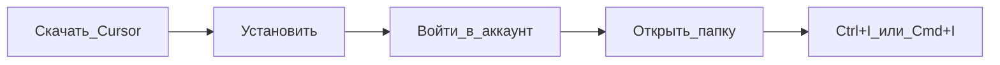

---
title: "Установка и вход в Cursor"
source: https://cursor.com/ru/docs/get-started/quickstart
audience: beginner
tier: 1
last_synced: 2026-07-02
---

## Простыми словами

Cursor — программа-редактор с встроенным ИИ. Как Word, но для кода и текстовых файлов, с умным помощником внутри.

## Когда вам это нужно

Первый запуск: скачали Cursor и не знаете, что нажать дальше.

## Пошагово

1. Скачайте с [cursor.com](https://cursor.com) (Windows: `.exe`, Mac: `.dmg`)
2. Установите и откройте программу
3. Войдите в аккаунт (нужен для Agent)
4. **File → Open Folder** — выберите папку с проектом (или создайте пустую)
5. Откройте Agent: **Windows/Linux `Ctrl+I`**, **Mac `Cmd+I`**

## Схема

## Частые ошибки

- Открыли файл, а не папку — Agent хуже видит проект. Откройте **папку**.
- Не вошли в аккаунт — Agent может быть недоступен.

## Официальная ссылка

[https://cursor.com/ru/docs/get-started/quickstart](https://cursor.com/ru/docs/get-started/quickstart)