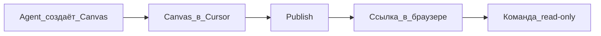

---
title: "Canvas и Shared Canvases"
source: https://cursor.com/docs/agent/tools/canvas
audience: beginner
tier: 2
last_synced: 2026-07-02
---

## Простыми словами

**Canvas** — интерактивный «холст» рядом с чатом: отчёт, дашборд, таблица со статистикой. Не длинный текст в чате, а отдельный экран с блоками и цифрами.

**Shared Canvas** — опубликованный холст: вы нажимаете **Publish**, получаете ссылку, коллеги открывают тот же вид в браузере (только просмотр).

## Когда вам это нужно

- Нужен отчёт или дашборд, а не простыня текста в чате
- Хотите показать результат команде без пересылки всего диалога
- Маркетинг, аналитика, аудит — всё, что удобнее видеть таблицей и графиком

## Canvas vs обычный ответ в чате

| | Ответ в чате | Canvas |
|--|--------------|--------|
| Формат | Текст, markdown | Интерактивный макет |
| Удобно для | Короткие ответы | Отчёты, дашборды, таблицы |
| Повторное открытие | Листать чат | Список canvas в проекте |
| Делиться с командой | Копировать чат | **Shared Canvas** (ссылка) |

## Пошагово: создать Canvas

1. В Agent попросите: «Сделай отчёт / дашборд по [теме] в canvas»
2. В конце ответа появится **карточка** — нажмите, чтобы открыть
3. Или Command Palette → **Open Canvas** (раздел View)
4. Проверьте цифры и заголовки; попросите агента поправить, если нужно
5. Canvas сохраняется в списке canvas проекта — можно открыть позже

## Пошагово: Shared Canvas (поделиться с командой)

**Нужно заранее:**

- Тариф **Pro**, **Teams** или **Enterprise** (Hobby — нельзя)
- Вы в **команде** (team)
- **Не** Legacy Privacy Mode (блокирует публикацию)

**Шаги:**

1. Откройте готовый Canvas
2. Нажмите **Publish** на панели инструментов
3. Скопируйте ссылку и отправьте коллегам
4. Коллеги открывают в браузере — **только просмотр**
5. Данные изменились — снова **Publish** (обновить снимок)
6. Админ команды: Dashboard → **Shared Canvases** — список и отключение для организации

## Схема

## Canvas через Skills

Повторяемые отчёты можно оформить как **skill**: один раз описали макет (секции, таблицы, запросы) — дальше короткий промпт «квартальный отчёт» и тот же вид canvas.

См. `knowledge-base/03-kontekst/skills.md`

## Частые ошибки

- Ждёте canvas без явной просьбы — скажите: «открой результат в canvas»
- **Publish** неактивен — проверьте тариф, команду и Privacy Mode
- Делитесь до проверки цифр — коллеги увидят ошибки в снимке
- Путают с Cloud Agents — это разные вещи (см. `06-oblako-i-api/cloud-agents.md`)

## Проверка

- Canvas открывается из карточки в чате
- После Publish ссылка работает у коллеги
- В Dashboard → Shared Canvases видна публикация

## Официальная ссылка

https://cursor.com/docs/agent/tools/canvas
