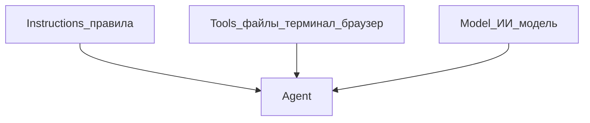

---
title: "Что такое Agent в Cursor"
source: https://cursor.com/ru/docs/agent/overview
audience: beginner
tier: 1
last_synced: 2026-07-02
---

## Простыми словами

**Agent** — помощник, который сам ищет файлы, вносит правки и запускает команды. Вы описываете цель — он выполняет.

## Когда вам это нужно

Нужно что-то сделать в проекте: создать страницу, исправить ошибку, настроить файл.

## Три кита Agent

| Компонент | Что это | Аналогия |
|-----------|---------|----------|
| **Instructions** | Rules и системные подсказки | Должностная инструкция |
| **Tools** | Чтение файлов, терминал, браузер | Инструменты на столе |
| **Model** | Выбранная ИИ-модель | Какой специалист думает |

## Пошагово

1. `Ctrl+I` (Win) / `Cmd+I` (Mac)
2. Опишите задачу простым языком
3. Следите за **diff** — что меняется
4. Примите или отклоните правки

## Что умеет Agent (инструменты)

- Искать по проекту
- Читать и редактировать файлы
- Запускать команды в терминале
- Искать в интернете
- Работать с браузером (тесты страниц)
- Генерировать картинки (макеты)

## Частые ошибки

- Ждёте, что Agent «знает всё» без контекста — укажите `@file` или опишите задачу чётче
- Не смотрите diff — всегда проверяйте изменения

## Официальная ссылка

https://cursor.com/ru/docs/agent/overview
