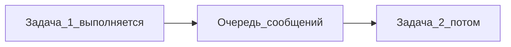

---
title: "Очередь сообщений Agent"
source: https://cursor.com/ru/docs/agent/overview
audience: beginner
tier: 2
last_synced: 2026-07-02
---

## Простыми словами

Пока Agent работает, вы можете **поставить следующее задание в очередь** — оно выполнится автоматически, когда текущее закончится.

## Когда вам это нужно

Agent ещё думает, а вы уже знаете следующий шаг.

## Пошагово

1. Agent выполняет задачу
2. Введите следующую инструкцию
3. **Enter** — сообщение в **очередь** (подождёт)
4. **Ctrl+Enter** (Win) / **Cmd+Enter** (Mac) — **сразу**, прервать текущее направление

## Схема

## Частые ошибки

- Ctrl+Enter когда не хотели прерывать — используйте обычный Enter для очереди

## Официальная ссылка

https://cursor.com/ru/docs/agent/overview
