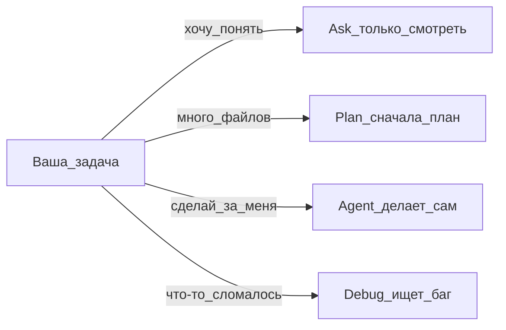

---
title: "Режимы Agent / Ask / Plan / Debug"
source: https://cursor.com/ru/help/ai-features/agent
audience: beginner
tier: 1
last_synced: 2026-07-02
---

## Простыми словами

В Cursor четыре «режима работы» помощника. Как разные отделы: один только смотрит, другой делает, третий сначала планирует.

## Таблица режимов

| Режим | Лучше для | Меняет файлы? |
|-------|-----------|---------------|
| **Agent** | Сделать задачу, рефакторинг, фикс | Да |
| **Ask** | Понять код, задать вопросы | Нет (только чтение) |
| **Plan** | Большая задача на много файлов | Да, после вашего «ОК» на план |
| **Debug** | Сложные баги | Да |

## Схема выбора

## Как переключить

- **Shift+Tab** в поле ввода Agent
- Или выпадающий список режима в панели Agent

## Важно

У каждого режима **свой контекст**. Сменили задачу — начните **новый чат**.

## Пошагово (типичный день)

1. **Ask:** «Объясни, как устроен этот проект»
2. **Plan:** «Добавь форму обратной связи на 3 страницы»
3. Одобрите план → Agent строит
4. **Debug:** если что-то сломалось и непонятно почему

## Частые ошибки

- Plan не одобрили — Agent не начнёт код (это норма)
- Смешали две большие задачи в одном чате — контекст переполнится

## Официальная ссылка

https://cursor.com/ru/help/ai-features/agent
