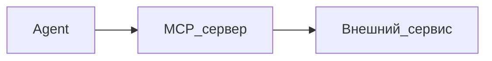

---
title: "MCP — подключение внешних инструментов"
source: https://cursor.com/ru/docs/context/mcp
audience: beginner
tier: 2
last_synced: 2026-07-02
---

## Простыми словами

**MCP** (Model Context Protocol) — способ подключить к Cursor внешние сервисы: браузер, документацию, WordPress, Wordstat и т.д.

## Аналогия

Как USB-разъёмы: один стандарт — много устройств. MCP — «разъём» для инструментов ИИ.

## Когда вам это нужно

Agent должен не только править файлы, но и ходить в API, браузер, базы.

## Пошагово (общая схема)

1. Файл `.cursor/mcp.json` в проекте (или настройки MCP в Cursor)
2. Добавьте сервер по инструкции поставщика
3. Перезапустите Cursor
4. В Agent проверьте: «какие MCP tools доступны?»

## Схема

## Частые ошибки

- Неверный JSON в mcp.json — весь MCP не загрузится
- Секреты в Git — храните в env, не в репозитории

Подробный playbook: `playbooks/02-podklyuchit-mcp.md`

## Официальная ссылка

[https://cursor.com/ru/docs/context/mcp](https://cursor.com/ru/docs/context/mcp)