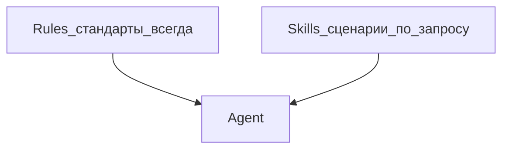

---
title: "Skills — рецепты для задач"
source: https://cursor.com/docs/skills
audience: beginner
tier: 2
last_synced: 2026-07-02
---

## Простыми словами

**Skill** — пошаговый рецепт для повторяемой задачи. Rules говорят «как всегда»; Skill — «как сделать вот это».

## Когда вам это нужно

Одна и та же операция: чеклист публикации, SEO-проверка, деплой.

## Где лежат

- Проект: `.cursor/skills/имя-skill/SKILL.md`
- Глобально: `~/.cursor/skills/имя-skill/SKILL.md`

## Пошагово

1. Создайте папку `.cursor/skills/moy-skill/`
2. Файл `SKILL.md` с блоком:

```markdown
---
name: moy-skill
description: Когда нужен чеклист перед публикацией
---
```

3. Опишите шаги в теле файла
4. Agent подхватит skill по описанию или вызовете `/moy-skill`

## Rules vs Skills



## Частые ошибки

- Skill без `description` — Agent не поймёт, когда вызывать
- Путать skill с rule — rule короче и «всегда», skill — workflow

## Официальная ссылка

https://cursor.com/docs/skills
