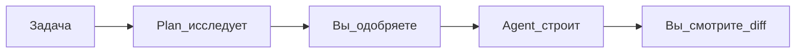

---
title: "Plan Mode — workflow"
source: https://cursor.com/ru/docs/get-started/quickstart
audience: beginner
tier: 2
last_synced: 2026-07-02
---

## Простыми словами

**Plan Mode** — сначала план на бумаге (в чате), вы читаете и одобряете, потом код.

## Когда вам это нужно

Задача затрагивает много файлов или вы боитесь, что Agent сделает не то.

## Пошагово

1. `Shift+Tab` → выберите **Plan**
2. Опишите задачу
3. Agent исследует проект и задаст уточняющие вопросы
4. Появится **план** — прочитайте
5. Нажмите одобрение — Agent начнёт правки
6. Смотрите diff по шагам

## Схема

## Частые ошибки

- Ждёте код сразу — в Plan сначала только план
- Одобрили не читая — риск лишней работы

## Официальная ссылка

[https://cursor.com/ru/docs/get-started/quickstart](https://cursor.com/ru/docs/get-started/quickstart)