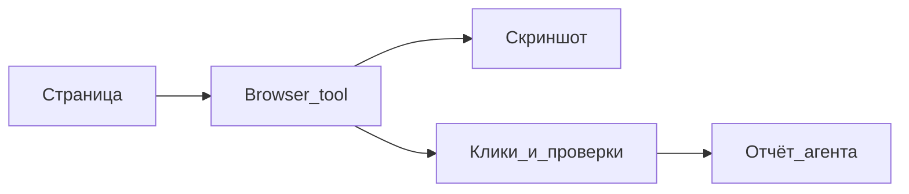

---
title: "Browser tool — проверка сайта глазами агента"
source: https://cursor.com/docs/agent/tools/browser
audience: beginner
tier: 1
last_synced: 2026-07-02
---

# Browser tool — проверка сайта глазами агента

## Простыми словами

Browser tool позволяет Agent открыть страницу, нажимать кнопки, делать скриншоты и проверять интерфейс как обычный пользователь.

## Когда вам это нужно

- Проверить лендинг после правок
- Найти визуальную ошибку
- Протестировать форму
- Сравнить дизайн с ожиданием

## Пошагово

1. Запустите сайт локально или дайте URL
2. Попросите: «Открой страницу и проверь, что видит пользователь»
3. Agent сделает snapshot или screenshot
4. Попросите проверить конкретный сценарий: кнопка, форма, меню
5. После проверки попросите список проблем и что исправить

## Схема

## Частые ошибки

- Не запущен локальный сайт
- Нужен логин или captcha — Agent не должен обходить вручную
- Не указали, какой сценарий проверять

## Официальная ссылка

https://cursor.com/docs/agent/tools/browser
