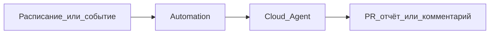

---
title: "Automations — запуск агентов по расписанию и событиям"
source: https://cursor.com/docs/cloud-agent/automations
audience: intermediate
tier: 2
last_synced: 2026-07-02
---

# Automations — автоматический запуск агентов

## Простыми словами

Automations — это когда агент запускается сам: по расписанию, событию или webhook. Например, «каждое утро проверить issue» или «после события в GitHub подготовить PR».

## Когда это нужно

- Регулярные проверки
- Ежедневные отчёты
- Автоматические PR
- Интеграции с GitHub/Slack/Linear

## Схема

## Для новичка

Не начинайте с Automations. Сначала сделайте задачу вручную через Agent, потом превратите повторяемую задачу в automation.

## Официальная ссылка

https://cursor.com/docs/cloud-agent/automations
