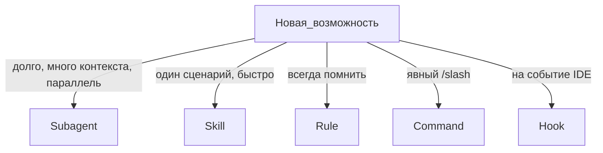

# Выбор правильного артефакта

## Таблица решений

| Критерий | Subagent | Skill | Rule | Command | Hook |
|----------|----------|-------|------|---------|------|
| Отдельное контекстное окно | Да | Нет | Нет | Нет | Нет |
| Параллельный запуск | Да | Нет | — | — | — |
| Автовызов Agent | По description | По description | alwaysApply / intelligent | Только вручную | По событию |
| Редактирует файлы | Если `readonly: false` | Через Agent | — | Делегирует Task | Скрипт |
| Масштаб 100+ | Реестр + категории | Папки skills/ | Много .mdc | commands/ | hooks.json |

## Типичные ошибки

| Ошибка | Правильно |
|--------|-----------|
| Mentor-наставник как skill | Subagent `readonly: true` |
| Maintainer KB как subagent без skill | Subagent + skill с `disable-model-invocation: true` |
| Роутинг 100 агентов в одном rule | Категории + `t-800-factory-routing` + registry |
| Changelog как subagent | Skill `generate-changelog` |

## Где лежат

| Артефакт | Проект | Плагин T-800 (install) | User-home (отдельный surface) |
|----------|--------|------------------------|-------------------------------|
| Subagent | `.cursor/agents/` | `plugins/local/t-800-agent/agents/` | `~/.cursor/agents/` (не зеркалится install) |
| Skill | `.cursor/skills/name/SKILL.md` | `plugins/local/.../skills/` | `~/.cursor/skills/` |
| Rule | `.cursor/rules/*.mdc` | `plugins/local/.../rules/` | `~/.cursor/rules/` (consent: mandatory-routing) |
| Command | `.cursor/commands/` | `plugins/local/.../commands/` | `~/.cursor/commands/` |
| Hook | `.cursor/hooks.json` | `plugins/local/.../hooks.json` | `~/.cursor/hooks.json` |

## Ссылки

- https://cursor.com/ru/docs/subagents
- https://cursor.com/docs/skills
- https://cursor.com/ru/docs/context/rules
- https://cursor.com/docs/hooks
