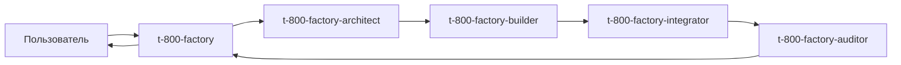

# Граф связей и оркестрация

## Зачем реестр

При 10+ субагентах нельзя держать связи только в голове. `registry/agents-registry.json` — единый источник правды.

## Поля связи в реестре

```json
{
  "id": "my-agent",
  "calls": ["t-800-factory-auditor"],
  "calledBy": ["t-800-factory"],
  "category": "factory",
  "readonly": true,
  "pairsWith": ["my-agent-skill"]
}
```

| Поле | Смысл |
|------|-------|
| `calls` | Кого этот агент может делегировать через Task |
| `calledBy` | Кто обычно вызывает этого агента |
| `category` | Группа для роутинга (factory, mentor, content, …) |
| `pairsWith` | Связанный skill/command/rule |

## Пайплайн T-800 Factory



## Контракт передачи между агентами

Каждый этап возвращает структуру (см. `shared/t-800-factory-contract.md`):

1. **status** — ok | needs_input | blocked
2. **artifact** — пути созданных файлов
3. **handoff** — что передать следующему агенту
4. **registry_patch** — JSON-фрагмент для реестра

## Вложенность (Cursor 2.5+)

- Главный Agent → subagent → subagent (макс. 2 уровня вложенности)
- Subagent, запущенный subagent'ом, **не может** запускать ещё одного
- Оркестратор-лид должен знать это ограничение

## Проверка целостности

```powershell
.\scripts\audit-agent-graph.ps1
```

Проверяет: файл существует, `calls`/`calledBy` симметричны, нет висячих ссылок.

## Resume для длинных пайплайнов

```
Resume agent <id> and continue integration step
```

Фоновые субагенты пишут в `~/.cursor/subagents/`.
