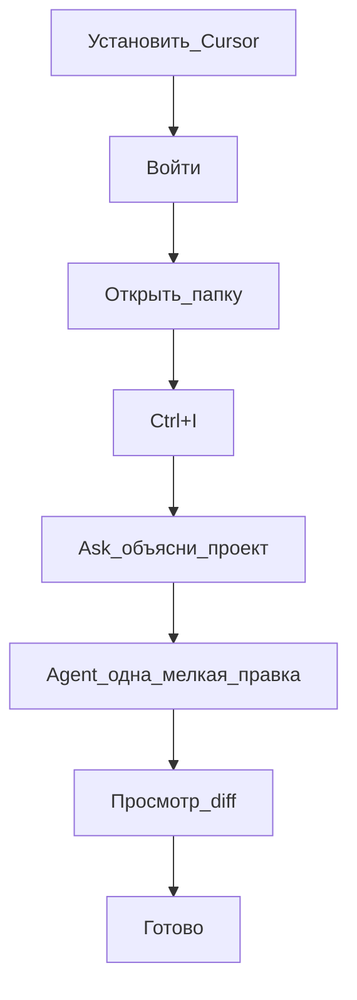

# Playbook 00 — Первый раз в Cursor

**Для кого:** день 1, любая профессия  
**Результат:** открыта папка, первый диалог с Agent, одна безопасная правка, просмотр diff

## Схема



## Чеклист

- [ ] Скачать и установить Cursor
- [ ] Войти в аккаунт
- [ ] Создать папку проекта и **File → Open Folder**
- [ ] `Ctrl+I` — открыть Agent
- [ ] Режим **Ask**: «Объясни эту папку простым языком»
- [ ] Режим **Agent**: «Предложи одно безопасное улучшение (текст/UI). Подожди моего выбора»
- [ ] Выбрать одно предложение
- [ ] Просмотреть **diff** — зелёное/красное
- [ ] Принять или отклонить правку
- [ ] Если не понравилось — **Восстановить контрольную точку**

## Промпты (копировать)

**Ask:**
```
Объясни эту кодовую базу простым языком. Что здесь главное?
```

**Agent:**
```
Предложи три маленьких безопасных улучшения. Объясни каждое. Жди, пока я выберу одно.
```

## Проверка

- Слева видна ваша папка
- В чате был ответ Agent
- Вы видели diff хотя бы одного файла

## Следующий шаг

Playbook 01 — первая автоматизация (rule + skill)

## KB

- `knowledge-base/01-pervye-shagi/`
- `knowledge-base/02-agent-i-rezhimy/rezhimy-tablica.md`
