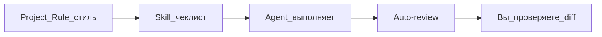

# Playbook 01 — Первая автоматизация

**Для кого:** маркетолог, офис, фрилансер  
**Результат:** одно project rule + один skill + безопасный Run Mode

## Схема



## Чеклист

- [ ] Создать rule: `/create-rule` — «Пиши по-русски, без воды, для не-технической аудитории»
- [ ] Папка `.cursor/skills/moy-checklist/SKILL.md` с шагами перед публикацией
- [ ] Settings → Run Mode → **Auto-review** (не Run Everything)
- [ ] Тестовая задача: «По skill moy-checklist проверь @README.md»
- [ ] Просмотреть diff

## Пример SKILL.md (минимум)

```markdown
---
name: moy-checklist
description: Чеклист перед публикацией текста на сайт
---

1. Проверить заголовок H1
2. Проверить орфографию
3. Проверить ссылки
4. Сообщить что не готово
```

## Проверка

- Rule виден в `.cursor/rules/`
- Agent упомянул skill или вызвал `/moy-checklist`
- Терминал спрашивал разрешение (Auto-review)

## Следующий шаг

Playbook 02 — MCP

## KB

- `knowledge-base/03-kontekst/rules.md`
- `knowledge-base/03-kontekst/skills.md`
- `knowledge-base/04-bezopasnost/run-mode.md`
