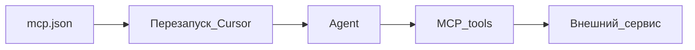

# Playbook 02 — Подключить MCP

**Для кого:** когда Agent нужен доступ к браузеру, API, docs  
**Результат:** рабочий MCP-сервер, проверка в Agent

## Схема



## Чеклист

- [ ] Узнать у поставщика MCP: имя сервера, command, env
- [ ] Создать или отредактировать `.cursor/mcp.json`
- [ ] Секреты — в переменные окружения, **не в Git**
- [ ] Перезапустить Cursor
- [ ] Settings → MCP — сервер зелёный / активен
- [ ] В Agent: «Какие MCP tools доступны?»
- [ ] Одна тестовая операция

## Пример структуры mcp.json (шаблон)

```json
{
  "mcpServers": {
    "example": {
      "command": "npx",
      "args": ["-y", "example-mcp-server"],
      "env": {}
    }
  }
}
```

Точный формат — в документации вашего MCP.

## Частые ошибки

- [ ] JSON с запятой лишней — проверить валидатором
- [ ] Не перезапустили Cursor
- [ ] Ключ API в репозитории — убрать в .env

## Проверка

Agent видит tools и выполняет тест без ошибки авторизации

## KB

- `knowledge-base/03-kontekst/mcp-basics.md`

## Официальная ссылка

https://cursor.com/ru/docs/context/mcp
