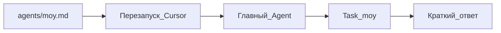

# Playbook 03 — Создать своего субагента

**Для кого:** продвинутый новичок  
**Результат:** файл в `.cursor/agents/`, вызов через Agent

## Схема



## Чеклист

- [ ] Создать `.cursor/agents/proverka-teksta.md`
- [ ] Frontmatter: `name`, `description`, `readonly: true` если только проверка
- [ ] Тело: роль и шаги
- [ ] Для плагина T-800: положить в `agents/` и запустить `install-plugin` → `~/.cursor/plugins/local/t-800-agent/agents/`
- [ ] Перезапустить Cursor
- [ ] Попросить: «Используй subagent proverka-teksta для @file.md»

## Шаблон файла

```markdown
---
name: proverka-teksta
description: Проверяет текст на ясность для новичков. Use proactively after text edits.
readonly: true
---

Ты редактор для неспециалистов.
1. Найди непонятные термины
2. Предложи простые замены
3. Список замечаний по приоритету
```

## Проверка

Agent делегировал задачу и вернул структурированный отчёт

## KB

- `knowledge-base/03-kontekst/subagents.md`

## Официальная ссылка

https://cursor.com/ru/docs/subagents
