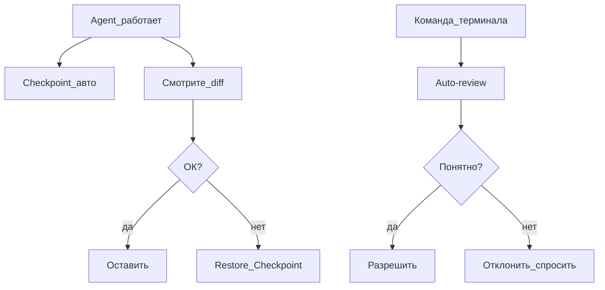

# Playbook 04 — Откат и безопасность

**Для кого:** все  
**Результат:** умеете откатывать правки и безопасно разрешать терминал

## Схема



## Чеклист

- [ ] Settings → Run Mode → **Auto-review**
- [ ] Не включать **Run Everything**
- [ ] Перед большой задачей — мысленно: «есть checkpoint»
- [ ] После правок — всегда diff
- [ ] Откат: hover на сообщение → **Восстановить контрольную точку**
- [ ] Rule: не коммитить `.env` и пароли

## Если команда непонятна

Спросите в чате:
```
Объясни эту команду терминала простыми словами. Что может пойти не так?
```

## Проверка

- Вы отклонили хотя бы одну тестовую команду осознанно
- Знаете, где кнопка Restore Checkpoint

## KB

- `knowledge-base/02-agent-i-rezhimy/kontrolnye-tochki.md`
- `knowledge-base/04-bezopasnost/`

## Официальная ссылка

https://cursor.com/docs/agent/security
