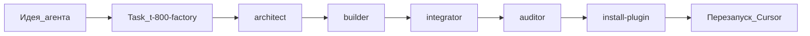

# Playbook 04 — T-800 Factory: создать субагента через отдел

**Для кого:** продвинутый пользователь, автор плагинов  
**Результат:** новый субагент в `agents/`, запись в registry, валидация пройдена

## Схема

## Шаги

1. Сформулируйте бриф: роль, триггеры, readonly?, категория
2. Вызовите `/t-800-factory` или `Task(t-800-factory)`
3. Дождитесь спецификации от architect — уточните при `needs_input`
4. Builder создаст `agents/{name}.md` (+ command/rule при необходимости)
5. Integrator обновит `registry/agents-registry.json` и `docs/T-800-AGENTS.md`
6. Auditor запустит `validate-agents.ps1` и `audit-agent-graph.ps1`
7. Выполните `.\scripts\install-plugin.ps1` и перезапустите Cursor
8. Проверьте: `Task({name})` или `/{name}`

## Чеклист качества

- [ ] `description` с Use when / Do NOT use when
- [ ] Уникальный `name` в registry
- [ ] Симметричные calls/calledBy
- [ ] validate + audit без FAIL

## KB

- `knowledge-base/13-agent-factory/`
- `shared/t-800-factory-contract.md`

## Официальная ссылка

https://cursor.com/ru/docs/subagents
