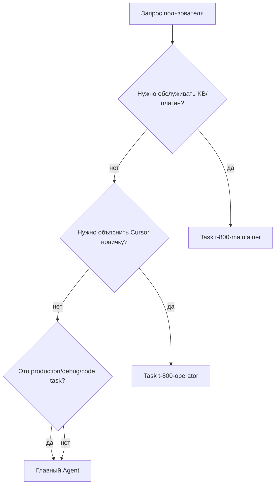

# T-800 Agent — матрица маршрутизации

Цель: не путать пользовательского наставника `t-800-operator`, maintainer-субагента `t-800-maintainer` и обычную работу главного Agent.

## Решение за 10 секунд

## Таблица случаев

| Запрос | Кого звать | Почему |
|--------|------------|--------|
| «Я новичок, что нажать?» | `Task(t-800-operator)` | Нужен наставник простым языком |
| «Объясни Ask/Plan/Agent» | `Task(t-800-operator)` | Обучение режимам |
| «Что такое MCP?» | `Task(t-800-operator)` | Обучение концепции |
| «Сделай rule/skill для меня» | Сначала `Task(t-800-operator)`, потом главный Agent | Сначала понять выбор, затем выполнить |
| «Обнови базу знаний T-800 Agent» | `Task(t-800-maintainer)` | Это обслуживание KB |
| «Запусти sync docs» | `Task(t-800-maintainer)` | Это maintainer workflow |
| «Проверь, почему Canvas не шарится» | `Task(t-800-operator)` | Объяснение UI/условий |
| «Сделай сайт/код/фикс» | Главный Agent | Это выполнение, не обучение Cursor |
| «Production падает, вот логи» | Debug / главный Agent | Нужен дебаг, не наставник |

## Антиошибки

- Не вызывать `t-800-operator`, если пользователь просит «просто сделай без объяснений».
- Не вызывать `t-800-maintainer` для обычных вопросов новичка.
- Не создавать `skills/t-800-operator/SKILL.md`.
- Не копировать maintainer-поведение в `agents/t-800-operator.md`.
