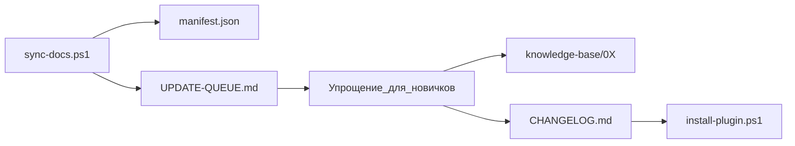

# Контракт обновления базы знаний T-800

## Цель

База знаний не устаревает молча. Любое изменение в официальной docs Cursor → очередь на ревью → упрощённая карточка для новичков.

## Источники (канон)

- https://cursor.com/ru/docs
- https://cursor.com/ru/learn
- https://cursor.com/ru/help
- https://cursor.com/ru/docs/api

## Цикл обновления

## Когда запускать sync

| Триггер | Действие |
|---------|----------|
| Раз в месяц (1-е число) | `.\scripts\sync-docs.ps1` |
| Вышел changelog Cursor | sync вручную |
| Пользователь: «в Cursor появилось X» | sync + проверить UPDATE-QUEUE |
| `manifest.json` старше 30 дней | sync при открытии проекта T-800 Agent |
| Новый URL в drafts, нет в INDEX | добавить карточку или в очередь |

## Что делает sync

1. Скачивает страницы → `knowledge-base/raw/`
2. Сравнивает SHA256 с `manifest.json`
3. **new** — URL впервые
4. **changed** — контент изменился
5. **unchanged** — без действий
6. Пишет `UPDATE-QUEUE.md` и `SYNC-REPORT.md`

## Что делает человек / агент-редактор

1. Открыть `UPDATE-QUEUE.md`
2. Для каждого пункта: упростить язык, добавить аналогию и mermaid
3. Обновить или создать карточку в `knowledge-base/0X-*/`
4. Обновить `INDEX.md`, `glossarium.md` при новых терминах
5. Записать в `CHANGELOG.md`
6. `.\scripts\install-plugin.ps1` — обновить глобальную копию

## Правило для T-800 Agent при ответе

Если вопрос про функцию, которой **нет** в KB и **нет** в manifest:

1. Честно: «В моей базе этого ещё нет»
2. Дать общий принцип, если возможно
3. Предложить: «Запустите `.\scripts\sync-docs.ps1` и проверьте UPDATE-QUEUE»
4. Ссылка на официальную docs как fallback

## Свежесть

- Карточка: `last_synced` в frontmatter
- Вся база: `knowledge-base/manifest.json` → `last_full_sync`
