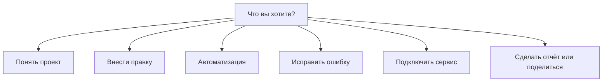

# Wizard Router — куда вести новичка

## Схема выбора

## Маршруты

| Намерение | Режим Cursor | Wizard |
|-----------|--------------|--------|
| Понять проект | Ask | `wizard-first-project.md` |
| Маленькая правка | Agent после Ask | `wizard-first-project.md` |
| Большая задача | Plan | `wizard-first-project.md` |
| Автоматизация | Plan → Agent | `wizard-automation.md` |
| Ошибка | Debug | `wizard-fix-error.md` |
| Внешний сервис | Plan | `wizard-connect-mcp.md` |
| Отчёт / дашборд | Agent + Canvas | `wizard-share-canvas.md` |
